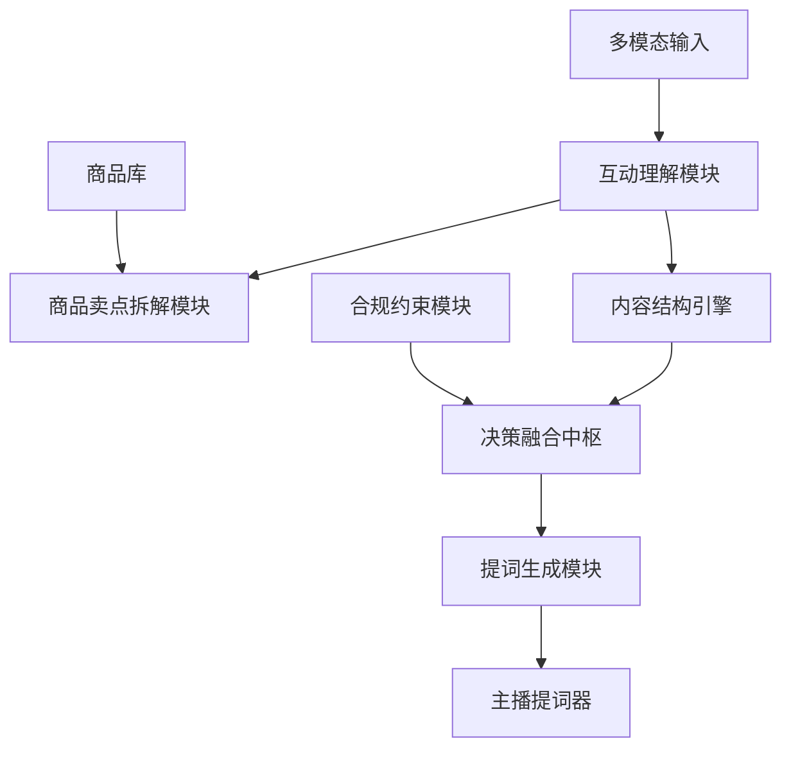

# Agent 模块实现

## 1. 任务背景

随着直播电商进入存量竞争时代，单纯依靠主播个人能力已难以应对复杂的市场环境。本项目旨在构建一个基于 AI 大模型及 Agent 架构的智能直播辅助系统，解决当前直播带货中普遍存在的以下痛点：

- 内容不可控
- 转化率低
- 合规风险高
- 对主播个人依赖过重


## 2. 任务目标

基于提供的 AI Agent 核心模块定义，实现一个多源数据融合与动态决策的智能直播辅助 Agent。该 Agent 需要能够实时接收多模态输入（弹幕、直播阶段、后台数据），通过各模块协同推理，最终生成精准、实时、可执行的提词建议，辅助主播进行结构化、高转化且合规的直播。


## 3. 核心模块定义

### 3.1 模块组成

| 模块名称 | 核心职责 |
| --- | --- |
| 直播内容结构引擎 | 管理直播阶段划分与时间规划，实时提示当前阶段及下一阶段准备 |
| 内容合规约束模块 | 内置违禁词库，对生成内容进行前置过滤，提供合规替代方案 |
| 商品成交卖点拆解模块 | 将产品参数转化为利益点，结合弹幕情绪推送最匹配卖点 |
| 互动理解与内容调整模块 | 实时弹幕语义分析，提取高频问题、负面反馈、购买意向 |
| 实时内容提示与提词模块 | 汇总各模块输出，优先级排序，生成简洁易读的提词指令 |


### 3.2 模块交互关系




## 4. 开发要求

### 4.1 核心功能实现

实现一个 Agent 决策中枢，能够接收以下输入并输出提词建议。

#### 输入数据格式示例

```json
{
  "直播状态": {
    "当前阶段": "产品讲解期",
    "已直播时长": 900,
    "计划总时长": 3600,
    "当前产品": "精华液_sku_12345"
  },
  "弹幕数据": {
    "最近30秒消息": [
      "油皮能用吗？",
      "有没有小样？",
      "价格太贵了",
      "油皮能用吗？",
      "和XX大牌比怎么样？",
      "油皮能用吗？"
    ],
    "情绪分析": {
      "高频词": {"油皮": 3, "价格": 2, "小样": 1},
      "负面反馈": ["价格太贵了"]
    }
  },
  "商品数据": {
    "sku_id": "12345",
    "产品名称": "控油修护精华液",
    "规格": "30ml",
    "价格": 350,
    "成分": ["水杨酸", "烟酰胺", "透明质酸"],
    "功效": ["控油", "修护", "保湿"]
  },
  "后台数据": {
    "在线人数": 1250,
    "购物车点击率": "上升5%",
    "转化率": "2.3%"
  }
}
```

#### 输出要求

```json
{
  "提词指令": {
    "优先级": "高",
    "建议话术": "很多宝宝在问油皮能不能用，这款精华特意添加了水杨酸成分，就是专门针对油皮设计的，控油效果非常好！",
    "动作建议": "拿起产品展示成分表",
    "触发原因": "弹幕高频问题:油皮适用性",
    "合规检查": "通过"
  }
}
```


### 4.2 具体实现要求

#### 4.2.1 互动理解模块

- 实现弹幕的实时语义分析，识别用户意图（提问、负面、购买意向等）
- 实现高频问题的自动提取和聚合
- 对刷屏问题自动标记高优先级


#### 4.2.2 卖点拆解模块

- 接入商品库数据，实现产品参数到利益点的转换
- 实现卖点与用户问题的匹配算法
- 设计 Prompt，利用大模型生成针对性的卖点话术


#### 4.2.3 合规约束模块

- 内置广告法违禁词库（最低 100 个词）
- 实现生成内容的实时过滤
- 对违规内容提供替代方案


#### 4.2.4 决策融合与优先级排序

- 设计多源输入的优先级打分机制
- 处理模块间指令冲突（如：结构引擎要求进入促单环节 vs 互动模块要求回答问题）
- 实现可配置的决策规则引擎


## 5. 交付物要求

### 5.1 核心代码

- Agent 核心决策模块完整实现
- 各功能模块的接口定义与实现


### 5.2 文档

- 架构设计文档：模块划分、数据流转图、关键接口说明
- API 文档：输入输出格式、调用示例
- 部署说明：环境配置、启动方式、依赖清单


### 5.3 演示 Demo

- 提供一个简单的 Web 演示界面或命令行交互 Demo
- 能够模拟上述场景输入并展示 Agent 决策输出
- 录制一段 2 分钟以内的演示视频
